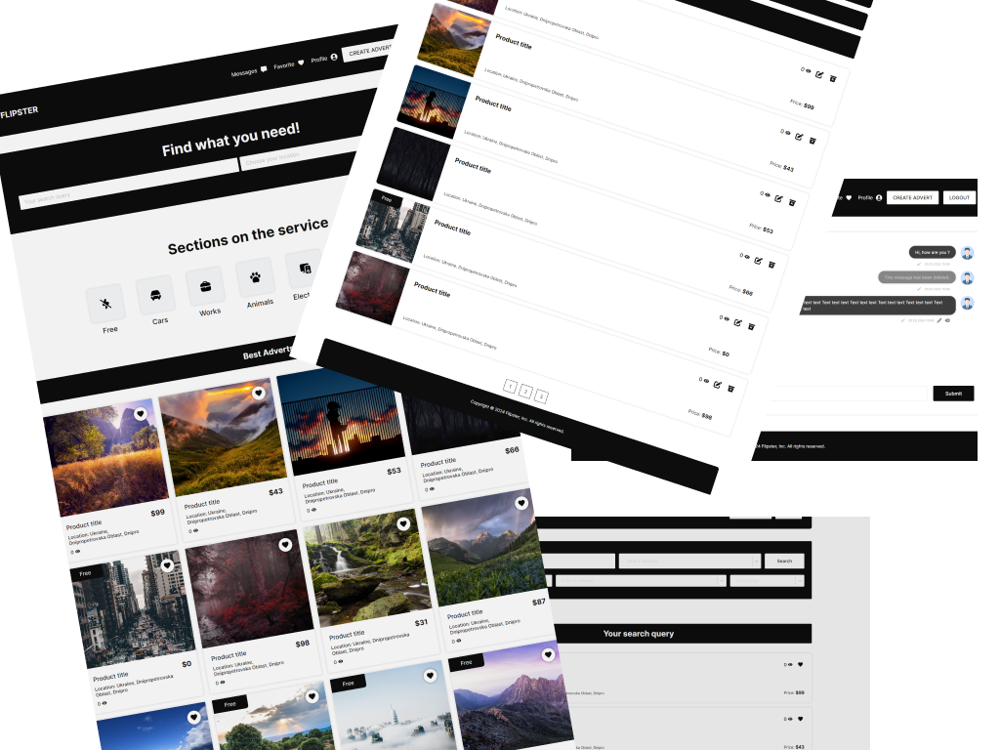

# <div style="display: flex; align-items: center; justify-content: start; gap: 10px;">  Flipster <div>



## About Client Side

This is a brief overview of the technologies used in the project client. The client was built on react + typescript, which are popular and powerful frameworks for creating web applications. React allows for creating reusable components and managing the user interface, while typescript adds static typing and other features to javascript. Vite was used as the project builder, which is a fast and modern tool that supports hot module replacement, code splitting, and other optimizations. The redux tool kit was used for state management, which is a library that simplifies the use of redux and provides useful utilities such as reducers, actions, selectors, and middleware. Query caching was implemented in the client to increase performance, which means that the client stores the results of previous requests and reuses them when possible. RTK Query was used to cache requests, which is a plugin for the redux tool kit that provides an easy way to define and use API endpoints. SignalR client (web socets) was used for chats, which is a library that enables real-time communication between the client and the server using web sockets or other protocols. For form validation react hook form was used, which is a library that leverages react hooks to handle form data and validation. For drop-down lists react select was used, which is a library that provides customizable and accessible select components. Swiper was used for sliders, which is a library that supports touch gestures, navigation, pagination, and other features for creating responsive sliders.

### Stack

-   React, React-select, React-hook-form
-   TypeScript, JavaScript
-   Redux toolkit
-   Swiper
-   Signalr-client

## About Server Side

The project's backend was built with c# dotnet core. The system design followed the distributed monolith pattern, which allows for modular development and deployment. The modules communicate through the contracts class, which defines the interfaces for each module. The project uses an inMemory database for fast testing purposes. However, this database should be replaced by a more reliable and persistent one after the project is installed and tested.

### Application structure

<div style="display: flex; justify-content: center;">
    
</div>

### Stack

-   C#, .NET, ASP.NET Core
-   Ef Core, Automapper,
-   Modular Monolith,
-   SignalR

### APIs

#### Auth APIs

```js
POST api/auth/visit/
POST api/auth/login/
POST api/auth/register/
POST api/auth/logout/
POST api/auth/refresh/
```

#### Users APIs

```js
GET api/users/
GET api/users/:userId/
GET api/users/my/
DELETE api/users/my/
PUT api/users/my/change-password/
PUT api/users/my/my/change-avatar/
PUT api/users/my/change-settings/
```

#### Locations APIs

```js
GET api/locations/
```

#### Favorites APIs

```js
POST api/favorites/
GET api/favorites/ids/
GET api/favorites/
```

#### Favorites APIs

```js
POST api/favorites/
GET api/favorites/ids/
GET api/favorites/
```

#### Recomendations APIs

```js
GET api/catalog/recommendations/ids/
GET api/catalog/recommendations/
```

#### Recomendations APIs

```js
GET api/catalog/recommendations/ids/
GET api/catalog/recommendations/
```

#### Categories APIs

```js
GET api/categories/
```

#### Catalog APIs

```js
GET api/catalog/
POST api/catalog/
GET api/catalog/:advertId/
DELETE api/catalog/:advertId/
PUT api/catalog/:advertId/
```

#### Chats APIs

```js
POST api/chats/
GET api/chats/
DELETE api/chats/:chatId/
```

#### Messages APIs

```js
GET api/chats/:chatId/messages/
```

## Quick Start

You must have yarn, dotnet, vite installed to run the application

Clone repository

```shell
git clone https://github.com/Bazl1/Flipster.git
cd ./Flipster
```

### Quick Start Server Side

```shell
cd server/src/Flipster.WebApi
dotnet run
```

### Quick Start Server Client

```shell
cd client/
yarn
yarn dev
```
